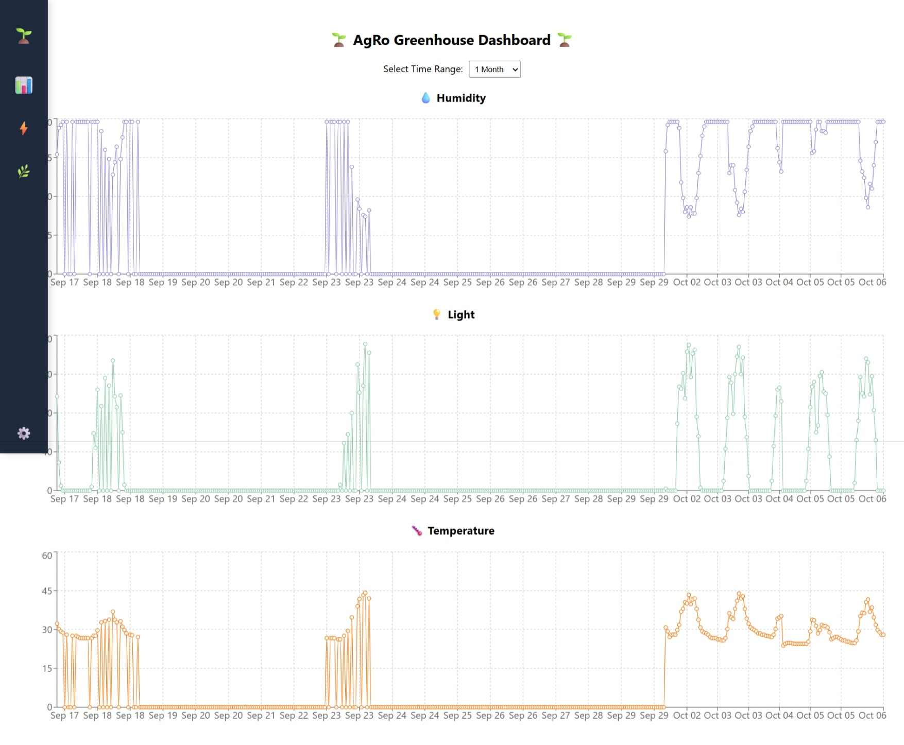
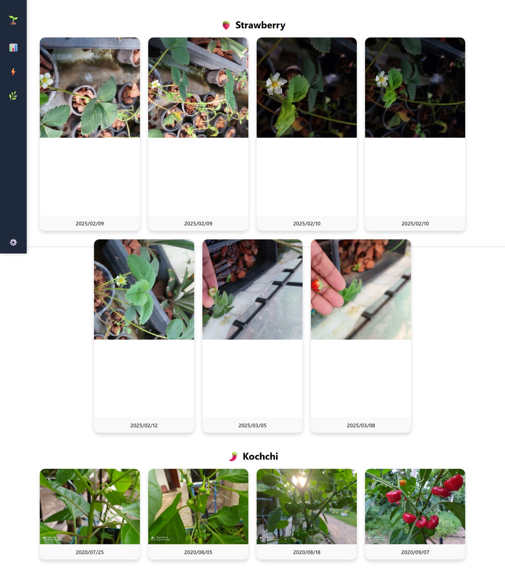

# 🌿 AgRo Greenhouse Dashboard v1

A modern, data-driven **Greenhouse Analytics Dashboard** built with **React.js** and **Firebase**, enabling real-time visualization of greenhouse environmental data and plant growth tracking.

🌐 **Live Demo:** [agrogreenhouse0-38d6a.web.app](https://agrogreenhouse0-38d6a.web.app)

---

## 📸 Preview

### 🏡 Greenhouse Dashboard

### 🍓 Plant Growth Tracking

> *Visualize greenhouse metrics like humidity and light levels — and track plant growth with timestamped image logs.*

---

## 🚀 Key Features

- 📊 **Real-Time Sensor Analytics** — Visualizes humidity, light, and environmental metrics  
- ⏱️ **Time Range Selector** — Analyze data by day, week, or month  
- 🌿 **Plant Growth Tracking** — Upload and view timestamped growth images (e.g., Strawberry)  
- ☁️ **Firebase Integration** — Cloud-hosted and synchronized data  
- 🧩 **Modular React Components** — Scalable and maintainable structure  
- 🖥️ **Responsive UI** — Clean and consistent design across all devices  

---

## 🧠 Tech Stack

| Technology | Purpose |
|-------------|----------|
| ⚛️ **React.js** | Frontend framework |
| 🔥 **Firebase** | Hosting & backend |
| 📈 **Recharts** | Data visualization |
| 💅 **CSS3 / Flexbox** | Styling & layout |
| 🧰 **npm** | Package management |

---

## 🏗️ Project Structure

analytics-dashboard-v1/
│
├── public/ # Static assets
├── src/ # React source files
│ ├── components/ # Charts, UI elements
│ ├── pages/ # Dashboard & plant tracking views
│ ├── services/ # Firebase and data integration
│ └── App.js # Root component
│
├── firebase.json # Firebase config
├── package.json # Project dependencies
└── README.md # Documentation

----
## 🧩 Future Enhancements

🌦️ Live IoT sensor data integration

🧾 Data export (CSV / PDF reports)

👥 Authentication & multi-user dashboards

📈 Multi-crop monitoring and comparison

-----
## 👨‍💻 Author

Developed by Aravinda Jay

💬 Contributions, ideas, and feedback are always welcome!

📄 License - This project is licensed under the MIT License — feel free to use and customize it.

